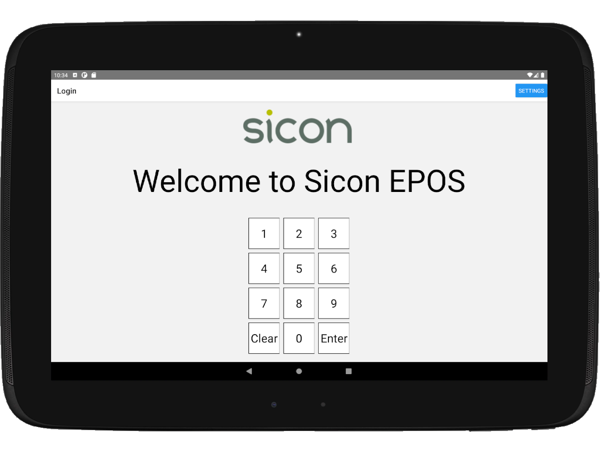
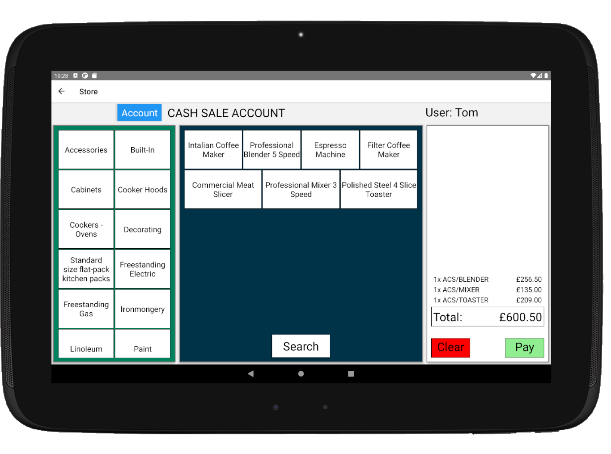

# SiconEPOS

The start of an EPOS system, created in React Native, for the Sicon annual conference as a prototype to gauge interest and gather feedback from Sage business partners.  I created this with some input from a colleague over a few weeks in evenings and on weekends.

The backend is the Sicon web api which connects to Sage 200.  I added extra methods to the web api where needed.

Current functionality includes...

* Dynamic loading of product groups, stock items and customer accounts based on the json response from a call to the web api
* Long press of stock items to see image and description
* Barcode scanning using usb scanner to add items to basket
* Multi screen, with the customer screen showing the basket and basket total
* Sales order generation in Sage 200
* Receipt printing via a connected receipt printer

